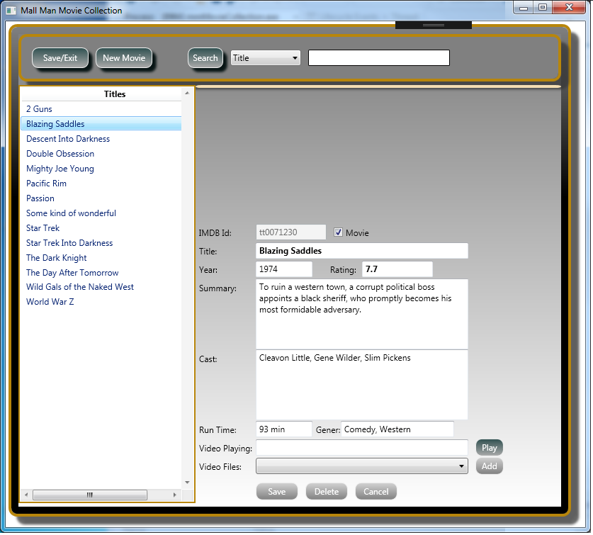
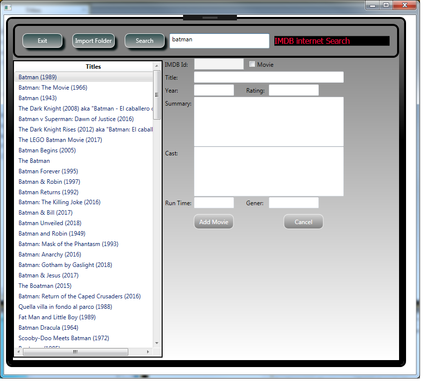

# Movie Collection App using WPF, MVVM light, XML database
This is a good example of using MVVM framework with WPF and C#
This example searches www.IMDB.com for movie data.  You can search using partial names of movies and then ask for all IMDB data to be imported into the app.

OR, you can type all of the data yourself.  You have a choice !!

	
## Sample Screen

## Sample Screen

MVVM light web site http://www.mvvmlight.net/

